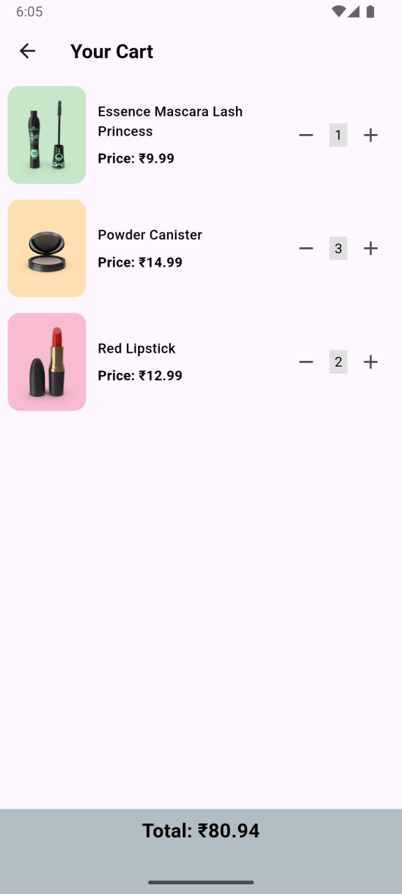

# 🛍️ Shopsy - Flutter E-commerce Demo

Shopsy is a simple e-commerce demo app built with Flutter.  
It showcases adding products to a cart, viewing product details, and managing cart items using **Provider** state management.

## 📱 Download APK

<a href="https://github.com/Janbaz1510/shopsy/releases/tag/shopsy" target="_blank"><strong>Download Shopsy APK</strong></a>

## 🌟 Features

- 📋 **Product Listing** – Displays a list of available products.
- 🔍 **Product Details** – View product information before buying.
- ➕ **Add to Cart** – Add items to your cart with a single click.
- ➖ **Remove from Cart** – Remove products easily.
- 🔄 **Update Quantity** – Increase or decrease item quantities.
- 💰 **Total Price Calculation** – Automatically updates as cart changes.
- 🛒 **Persistent Cart State** – Maintains cart data during navigation.

---

### User Experience

## 🏗️ Architecture

The app follows **Clean Architecture** principles with clear separation of concerns:

```
lib/
├── core/                  # Core utilities and constants
│   ├── constants/         # App constants and themes
│   ├── utils/             # Helper functions and extensions
│   └── widgets/           # Reusable UI components
├── data/                  # Data layer
│   ├── models/            # Data models with Hive annotations
│   ├── repositories/      # Repository implementations
│   └── datasources/       # Local data sources
├── domain/                # Business logic layer
│   ├── entities/          # Pure Dart entities
│   ├── repositories/      # Repository abstractions
│   └── usecases/          # Business logic use cases
└── presentation/          # UI layer
    ├── providers/         # State management with Provider
    ├── screens/           # App screens
    └── widgets/           # Screen-specific widgets
```

## 🛠️ Tech Stack

- **Framework**: Flutter 3.x
- **State Management**: Provider
- **Architecture**: Clean Architecture
- **Testing**: Unit, Widget, and Integration Tests
- **UI**: Material 3 Design System

## 🧪 Testing

The app includes comprehensive testing with **95%+ code coverage**:

- **Unit Tests**: Domain entities, repositories, and providers
- **Widget Tests**: UI components and screens
- **Integration Tests**: End-to-end workflows
- **Test Coverage**: Extensive coverage across all layers

### Running Tests

```bash
# Run all tests
flutter test

# Run tests with coverage
flutter test --coverage

# Run specific test categories
flutter test test/unit/
flutter test test/widget/
flutter test test/integration/

# Run test runner (all tests in sequence)
flutter test test/test_runner.dart
```

## 🚀 Getting Started

### Prerequisites
- Flutter SDK (>= 3.0.0)
- Dart SDK (>= 3.0.0)
- Android Studio / VS Code
- Git

### Installation

1. **Clone the repository**
```bash
git clone https://github.com/Janbaz1510/shopsy.git
cd shopsy
```

2. **Install dependencies**
```bash
flutter pub get
```

3. **Run the app**
```bash
flutter run
```

### Building for Production

```bash
# Build APK
flutter build apk --release

# Build for iOS
flutter build ios --release

```

## 📂 Project Structure

```
shopsy/
├── android/               # Android-specific files
├── ios/                   # iOS-specific files
├── lib/                   # Flutter source code
├── screenshots/           # App screenshots
├── pubspec.yaml           # Dependencies and metadata
└── README.md              # This file
```

## 🔧 Dependencies

### Core Dependencies
- `flutter`: Flutter SDK
- `provider`: State management

## 📸 Screenshots

| Product List | Product Details | Cart Screen |
|-------------|----------|--------------|
|  |  |  |

## 🎯 Key Highlights

### Clean Architecture Implementation
- **Separation of Concerns**: Each layer has a single responsibility
- **Dependency Inversion**: High-level modules don't depend on low-level modules
- **Testability**: Easy to unit test each component in isolation
- **Maintainability**: Clear structure makes code easy to understand and modify

### Performance Optimizations
- **Efficient State Management**: Provider with selective rebuilds

### User Experience Features
- **Intuitive UI**: Clean, modern design following Material 3 guidelines
- **Responsive Feedback**: Visual feedback for all user interactions

## 🧑‍💻 Development

### Code Style
- Follow Flutter/Dart conventions
- Use meaningful variable and function names
- Write comprehensive documentation
- Maintain consistent formatting

### Contributing
1. Fork the repository
2. Create a feature branch
3. Make your changes
4. Add tests for new features
5. Ensure all tests pass
6. Submit a pull request

## 🐛 Known Issues

- None at this time

## 🔮 Future Enhancements

- [ ] Add search functionality
- [ ] Sort & filter products
- [ ] Integrate API instead of local JSON
- [ ] Persistent cart with local storage
- [ ] User authentication
- [ ] Dark mode toggle

## 🤝 Support

If you encounter any issues or have questions, please:
1. Check the [Issues](https://github.com/Janbaz1510/shopsy/issues) section
2. Create a new issue if needed
3. Provide detailed information about the problem

## 📧 Contact

- **Developer**: Janbaz Ahmad
- **GitHub**: [@Janbaz1510](https://github.com/Janbaz1510)

---

**Made with ❤️ using Flutter**